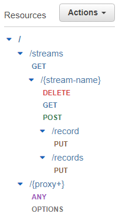
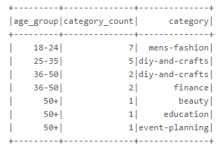
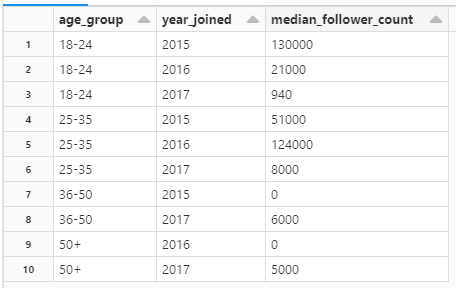

# Pinterest Data Pipeline

## Overview
This data pipeline collects data from Pinterest to be cleaned and analysed via two processes: 
1. Batch processing using Kafka and Amazon MSK
- ```user_posting_emulation.py```
- ```s3_bucket_mount.py```
1. Streaming using Kinesis
- ```user_posting_emulation_streaming.py```
- ```kinesis_streams.py```

An example format for the database credentials read in the posting emulation files can be found at ```db_creds.yaml.example```. Before attempting to run the posting emulation files, please copy ```db_creds.yaml.example``` and add the correct database credentials and API URLs, and rename the file to ```db_creds.yaml```.

## Local Installation Instructions
In order to replicate this project, you will require an AWS account. The following AWS services are utilised:
- EC2 Linux instance
- S3 Bucket
- API gateway
- MSK
- Kinesis

### Clone repo to local machine
```
git clone https://github.com/meljack1/pinterest-data-pipeline.git
```

### Create virtual environment using Conda
``` 
conda create --name pinterest --file requirements.txt
conda activate pinterest
```

### Create EC2 instance
Create an EC2 instance with the following settings:
- Software Image: Amazon Linux 2 AMI(HVM) - Kernel 5.10, SSD Volume Type
- Instance Type: t3.micro

Create a key pair and save it locally.

In the EC2 instance summary page, make a note of your public IPv4 DNS. This will be required to connect to your EC2 instance.

### Launch and configure EC2 instance
```
# Launch EC2 instance
ssh -i <key-pair-name> ec2-user@<public-dns> 
```

You will need to install the following to your EC2 instance:
- ["Apache Kafka"]('https://archive.apache.org/dist/kafka/3.5.1/kafka_2.13-3.5.1.tgz')
- ["IAM MSK authentication package"]('https://github.com/aws/aws-msk-iam-auth')
- ["Confluent.io Amazon S3 Connector"]('https://d1i4a15mxbxib1.cloudfront.net/api/plugins/confluentinc/kafka-connect-s3/versions/10.0.3/confluentinc-kafka-connect-s3-10.0.3.zip')

```
# Set classpath
export CLASSPATH=/home/ec2-user/kafka_2.13-3.5.1/libs/aws-msk-iam-auth-1.1.5-all.jar

# Launch Confluent server
cd confluent-7.2.0/bin/
./kafka-rest-start /home/ec2-user/confluent-7.2.0/etc/kafka-rest/kafka-rest.properties
```

### Create API Endpoints
In the AWS API gateway, you will require the following API endpoints: 



### Run posting emulation scripts
```
# Batch
python user_posting_emulation.py

# Streaming
python user_posting_emulation_streaming.py
```

## Batch Processing
### Kafka and EC2
As this was a cloud-based project, Apache Kafka was configured and run via an Amazon EC2 instance. In order to connect to the EC2 client machine, I created a .pem file containing my private key. I installed Kafka and the MSK authentication package onto the client machine, and configured my AWS IAM role to authenticate to an MSK cluster which would contain my topics:
- 124df56aef51.pin: for Pinterest posts data
- 124df56aef51.geo: for post geolocation data
- 124df56aef51.user: for post user data

### S3 Bucket and Confluent
After creating these three topics in my MSK cluster, I created an S3 bucket to store my topic data in, and configured a connection between my MSK topics and the S3 bucket using a custom plugin and Confluent connector. 

### Kafka REST Proxy Integration
Using an AWS Gateway REST API, I configured a Kafka REST proxy integration method to enable interaction with my MSK clusters using the API. This would enable me to use ```user_posting_emulation.py``` to send data to my Kafka topics via the API. 

### Databricks
Now that I had obtained and stored some data for each of my topics, I mounted the S3 bucket containing the data to a Databricks account. Using PySpark, I was able to create dataframes for the data from each topic, and perform cleaning and processing on each dataframe. 

Using the cleaned data, I was able to analyse the data to obtain useful information and statistics. 

1. The most popular category in each country
1. The most popular category each year
1. The user with the most followers in each country
1. The most popular category with each age group
``` 
df_most_popular_category_by_age = df_user.select(col("ind"), col("age"))\
    .join(df_pin.select(col("ind"), col("category")), df_user["ind"] == df_pin["ind"])\
    .drop("ind")\
    .withColumn("age_group", get_age_category_udf(col("age")))\
    .drop("age")\
    .groupBy("age_group", "category")\
    .agg(count('category').alias("category_count"))\
    .orderBy(col("category").asc())

df_most_popular_category_by_age.select("age_group", "category", "category_count")\
    .groupBy("age_group")\
    .agg(max("category_count").alias("category_count"))\
    .join(df_most_popular_category_by_age, on=['age_group','category_count'], how='inner')\
    .orderBy(col("age_group").asc()).show()
```


5. The median follower count with each age group
1. The number of users joining each year
1. The median follower count of users based on their joining year
1. The median follower count of users based on their joining year and age group
```
df_median_follower_count_by_age_and_year = df_user.select(col("ind"), col("age"), year("date_joined").alias("year_joined"))\
    .join(df_pin.select(col("ind"), col("follower_count")), df_user["ind"] == df_pin["ind"])\
    .drop("ind")\
    .withColumn("age_group", get_age_category_udf(col("age")))\
    .drop("age")\
    .groupBy("age_group", "year_joined")\
    .agg(percentile_approx("follower_count", 0.5).alias("median_follower_count"))\
    .orderBy(col("age_group").asc(), col("year_joined").asc())
```


These analyses can be found in ```pyspark_analysis.py```. Additionally, I created an Airflow DAG to trigger the running of this Databricks Notebook, which can be found in ```124df56aef51_dag.py```.

## Stream Processing & Kinesis
In addition to the batch processing methods, I created three Kinesis Data Streams (for pin, geo and user data respectively), and configured my API to allow it to list, create, describe and delete streams in Kinesis, as well as add records to streams in Kinesis. 

I modified the ```user_posting_emulation.py``` script to send Pinterest data to each Kinesis stream, and this modified file can be found at ```user_posting_emulation_streaming.py```. Additionally, I created a new Databricks file to read the Kinesis streams and clean the streamed data as before with the batch data, before writing the streaming data to three Delta Tables. The scripts for this can be found in ```kinesis_streams.py```.